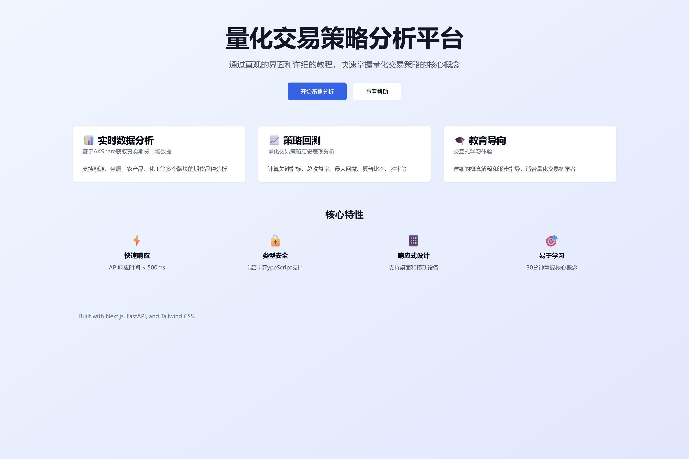
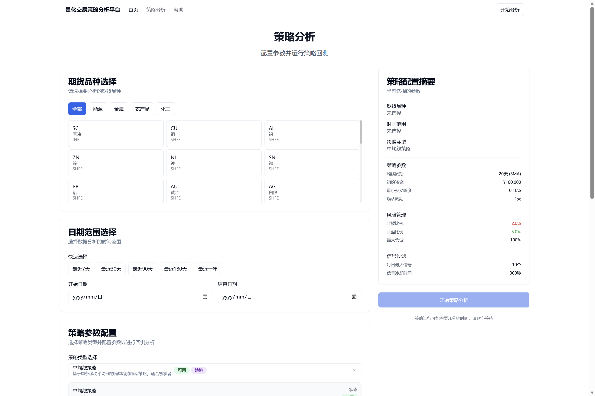
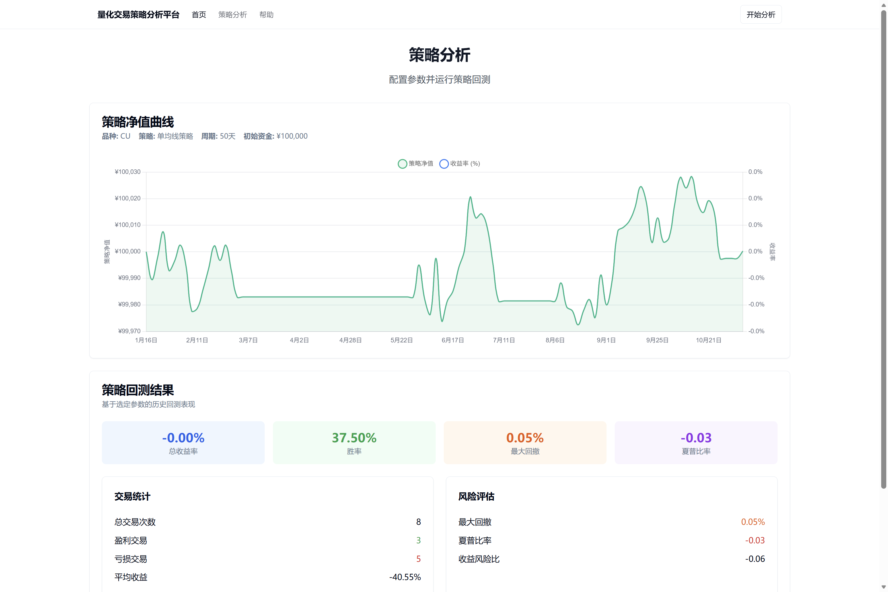
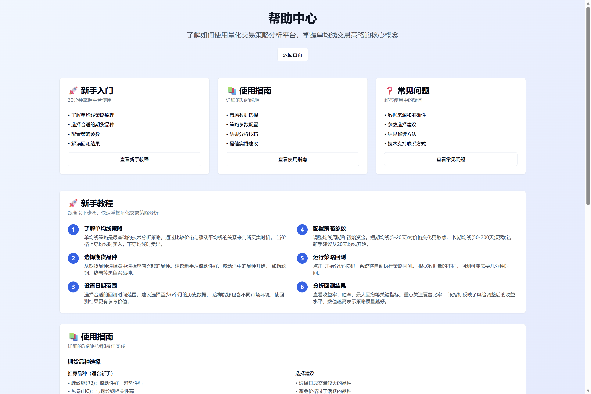

# 量化交易策略分析平台

一个教育导向的量化交易策略分析平台，专注于量化交易策略的学习和实践。

## 🌍 仓库地址

### 🇨🇳 国内用户 (推荐)
- **Gitee**: https://gitee.com/lion20231226/quantitative-trading-platform
- 访问速度快，适合国内用户克隆和使用

### 🌍 国际用户
- **GitHub**: https://github.com/lion231226/quantitative-trading-platform
- 面向国际用户和开源社区

## 项目概述

本项目旨在通过直观的界面和详细的教程，帮助用户在30分钟内掌握单均线交易策略的核心概念。平台提供真实的市场数据回测功能，让用户能够深入了解策略的运行机制和风险特征。

## 📸 界面预览

### 主页面 - 策略概览


### 策略分析页面


### 策略分析结果页面


### 帮助文档页面


### 核心特性

- 📊 **实时数据分析**: 基于AKShare获取真实期货市场数据
- 📈 **策略回测**: 单均线策略历史表现分析
- 🎓 **教育导向**: 交互式学习体验和详细教程
- ⚡ **快速响应**: API响应时间 < 500ms
- 🔒 **类型安全**: 端到端TypeScript支持
- 📱 **响应式设计**: 支持桌面和移动设备

## 技术栈

### 前端
- **Next.js 14+**: React全栈框架
- **TypeScript**: 类型安全的JavaScript
- **Tailwind CSS**: 实用优先的CSS框架
- **Chart.js**: 数据可视化库
- **React Query**: 服务端状态管理

### 后端
- **FastAPI**: 现代Python Web框架
- **SQLAlchemy**: Python ORM工具
- **SQLite**: 轻量级数据库
- **Redis**: 内存缓存服务
- **AKShare**: 中国期货数据源

### 开发工具
- **pnpm**: 前端包管理器
- **Black**: Python代码格式化
- **ESLint + Prettier**: 前端代码规范
- **pytest**: 后端测试框架
- **Jest**: 前端测试框架

## 项目结构

```
quant-trading-platform/
├── one-click-launcher/       # 🚀 智能启动器
│   ├── launcher.py           # 主启动器脚本
│   ├── config/               # 启动器配置
│   └── utils/                # 启动器工具模块
├── frontend/                 # Next.js前端
│   ├── src/
│   │   ├── app/             # App Router页面
│   │   ├── components/      # React组件
│   │   ├── lib/             # 工具函数
│   │   ├── types/           # TypeScript类型
│   │   └── hooks/           # React Hooks
│   └── package.json
├── backend/                  # FastAPI后端
│   ├── app/
│   │   ├── api/             # API路由
│   │   ├── core/            # 核心配置
│   │   ├── models/          # 数据模型
│   │   ├── schemas/         # API模式
│   │   ├── services/        # 业务逻辑
│   │   └── utils/           # 工具函数
│   ├── main.py              # 应用入口
│   └── requirements.txt
├── docs/                     # 项目文档
│   ├── stories/             # BMAD工作流Story文档
│   ├── epics/               # Epic文档
│   └── bmm-workflow-status.yaml  # 工作流状态
├── data/                     # 数据存储
└── config/                   # 配置文件
```

## 快速开始

### 环境要求

- **Python**: 3.11+
- **Node.js**: 18.0.0+
- **Git**: 最新版本

### 🚀 一键启动 (推荐)

### 智能启动器 - 最简单的启动方式

1. **克隆项目**

#### 国内用户 (推荐)
```bash
git clone https://gitee.com/lion20231226/quantitative-trading-platform.git
cd quantitative-trading-platform
```

#### 国际用户
```bash
git clone https://github.com/lion231226/quantitative-trading-platform.git
cd quantitative-trading-platform
```

2. **智能一键启动** ⭐

#### 所有平台统一命令
```bash
# 进入启动器目录
cd one-click-launcher

# 启动量化交易平台
python launcher.py

# 或者使用调试模式（推荐首次使用）
python launcher.py --debug
```

#### 启动器功能特性
- ✅ **自动环境检测** - Python/Node.js版本检查
- ✅ **智能依赖安装** - 自动安装缺失的依赖包
- ✅ **服务启动管理** - 按顺序启动后端和前端服务
- ✅ **健康状态监控** - 实时检查服务运行状态
- ✅ **自动浏览器打开** - 启动完成后自动访问应用
- ✅ **优雅关闭机制** - 支持Ctrl+C安全停止所有服务

#### 其他启动器命令
```bash
# 查看服务状态
python launcher.py --status

# 停止所有服务
python launcher.py --stop

# 仅安装依赖，不启动服务
python launcher.py --install-only

# 显示帮助信息
python launcher.py --help
```

3. **访问应用**
- 🌐 前端应用: http://localhost:3000
- 🔧 后端API: http://localhost:8000
- 📚 API文档: http://localhost:8000/docs

🎉 **恭喜！量化交易平台已成功启动！**
- ⚡ 启动时间通常在10-30秒内
- 🖥️ 支持Windows、macOS、Linux所有平台
- 🔄 自动处理环境配置和服务依赖

### 🔧 手动启动 (可选)

如果需要手动安装或遇到问题，请参考：
- [QUICK-START.md](QUICK-START.md) - 详细快速启动指南
- [DEPLOYMENT-LOCAL-PLAN.md](DEPLOYMENT-LOCAL-PLAN.md) - 本地部署方案文档


## 开发指南

### 代码规范

- **前端**: 使用ESLint + Prettier进行代码格式化
- **后端**: 使用Black进行代码格式化
- **提交**: 遵循Conventional Commits规范

### 测试

运行前端测试：
```bash
cd frontend
pnpm test
pnpm test:coverage
```

运行后端测试：
```bash
cd backend
pytest
pytest --cov=app --cov-report=html
```

### API文档

启动后端服务后，可以通过以下地址访问API文档：
- Swagger UI: http://localhost:8000/api/v1/docs
- ReDoc: http://localhost:8000/api/v1/redoc

## 策略说明

### 单均线策略

单均线策略是一个简单但有效的趋势跟踪策略：

**买入信号**: 当价格上穿移动平均线时（金叉）
**卖出信号**: 当价格下穿移动平均线时（死叉）
**风险控制**: 固定百分比止损

### 可调参数

- **MA周期**: 移动平均线计算周期（5-200天）
- **初始资金**: 策略启动资金（10,000-10,000,000）
- **止损比例**: 固定止损百分比（1%-20%）

## 性能指标

平台监控以下关键指标：

- **API响应时间**: < 500ms
- **策略计算时间**: < 10秒
- **页面加载时间**: < 3秒
- **数据缓存TTL**: 24小时

## 部署

### 前端部署（Vercel）

```bash
cd frontend
pnpm build
vercel --prod
```

### 后端部署（Docker）

```bash
cd backend
docker build -t quant-trading-backend .
docker run -p 8000:8000 quant-trading-backend
```

## 贡献指南

1. Fork项目
2. 创建功能分支 (`git checkout -b feature/AmazingFeature`)
3. 提交更改 (`git commit -m 'Add some AmazingFeature'`)
4. 推送到分支 (`git push origin feature/AmazingFeature`)
5. 开启Pull Request

## 许可证

本项目采用MIT许可证 - 查看 [LICENSE](LICENSE) 文件了解详情。

## 作者

**aTenderLion** - *项目创始者和主要开发者*

## 鸣谢

- [AKShare](https://github.com/akfamily/akshare) - 提供中国期货数据
- [FastAPI](https://fastapi.tiangolo.com/) - 现代Python Web框架
- [Next.js](https://nextjs.org/) - React全栈框架
- [Chart.js](https://www.chartjs.org/) - 灵活的图表库

## 支持

如果您觉得这个项目有用，请给它一个⭐️！

如有问题或建议，请通过以下方式联系：
- 提交Issue (推荐): [GitHub Issues](https://github.com/lion231226/quantitative-trading-platform/issues)
- 提交Issue (国内用户): [Gitee Issues](https://gitee.com/lion20231226/quantitative-trading-platform/issues)
- 邮箱: lion20231226@outlook.com

---

**免责声明**: 本平台仅用于教育和研究目的。交易有风险，投资需谨慎。