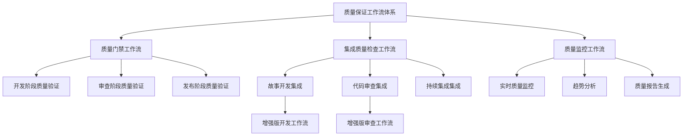
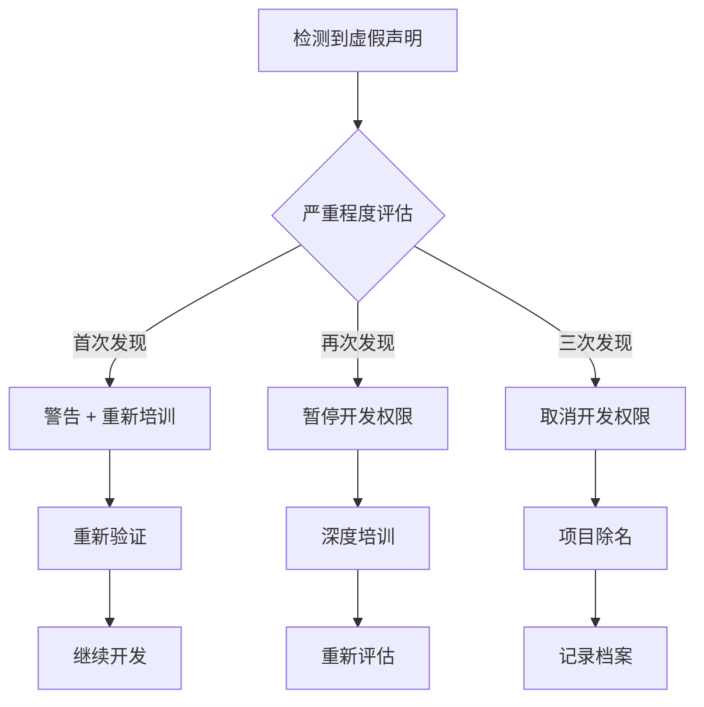

# 质量保证工作流集成指南

## 📋 概述

本文档描述了量化交易项目中完整的质量保证工作流集成体系，确保从故事开发到代码审查的全过程质量管控，防止虚假声明，保证代码质量。

## 🏗️ 质量保证工作流架构

### 工作流层次结构



### 核心工作流组件

1. **质量门禁工作流** (`quality-gate`)
   - 独立的质量检查工作流
   - 支持多种检查模式（dev, review, release）
   - 强制执行质量标准

2. **集成质量检查工作流** (`integrated-quality-check`)
   - 与其他工作流集成的质量检查
   - 支持多种集成点
   - 自动化质量验证

3. **质量监控工作流** (`quality-monitoring`)
   - 持续质量监控和报告
   - 趋势分析和预警
   - 质量改进建议

## 🔄 工作流集成机制

### 与开发工作流集成

**增强版开发工作流** (`dev-story-enhanced`)

#### 集成点
1. **开发前质量验证**
   ```bash
   # 步骤0：预开发质量保证验证
   invoke-workflow workflow="integrated-quality-check"
     parameter name="integration_point"="pre-development"
     parameter name="strict_mode"="true"
   ```

2. **开发中质量检查点**
   ```bash
   # 步骤3：开发中质量检查点
   invoke-workflow workflow="integrated-quality-check"
     parameter name="integration_point"="during-development"
     parameter name="strict_mode"="false"
   ```

3. **预审查综合质量验证**
   ```bash
   # 步骤6：预审查综合质量验证
   invoke-workflow workflow="integrated-quality-check"
     parameter name="integration_point"="pre-review"
     parameter name="strict_mode"="true"
   ```

#### 质量阻断机制
- 预开发质量检查失败 → 阻止开发开始
- 预审查质量检查失败 → 阻止提交审查
- 虚假声明检测 → 立即阻止并调查

### 与审查工作流集成

**增强版代码审查工作流** (`code-review-enhanced`)

#### 集成点
1. **故事提交质量验证**
   ```bash
   # 步骤1：故事提交质量验证
   invoke-workflow workflow="integrated-quality-check"
     parameter name="integration_point"="pre-review"
     parameter name="strict_mode"="true"
   ```

2. **预审查独立质量验证**
   ```bash
   # 步骤3：预审查独立质量验证
   invoke-workflow workflow="integrated-quality-check"
     parameter name="integration_point"="pre-review"
     parameter name="strict_mode"="true"
   ```

#### 质量增强审查
- 独立质量验证结果对比
- 质量声明真实性核查
- 质量标准合规性检查

## 🚨 质量阻断和升级机制

### 自动化阻断条件

#### 开发阶段阻断
```yaml
开发阻断条件:
  预开发质量检查失败:
    TypeScript编译错误 > 0
    基础测试失败
    环境质量问题

  预审查质量检查失败:
    编译错误 > 0
    测试失败 > 0
    覆盖率 < 80%
    虚假声明检测
```

#### 审查阶段阻断
```yaml
审查阻断条件:
  独立质量验证失败:
    与质量门禁结果不一致
    发现虚假声明
    关键质量标准违反

  质量标准违反:
    安全漏洞
    性能回归
    架构违规
```

### 升级机制

#### 虚假声明处理流程


## 📊 质量监控和报告

### 实时质量监控

#### 监控指标
```yaml
代码质量指标:
  TypeScript错误数: 目标=0
  ESLint违规数: 目标=0
  测试覆盖率: 目标>=80%
  测试通过率: 目标=100%

开发质量指标:
  虚假声明率: 目标=0%
  一次性通过率: 目标>=80%
  审查周期: 目标<=2天
  返工率: 目标<=20%

质量保证指标:
  质量门禁成功率: 目标=100%
  自动化捕获率: 目标>=90%
  问题解决时间: 目标<=24小时
```

#### 报告类型
1. **实时监控仪表板**
   - 当前质量状态
   - 实时指标更新
   - 预警信息

2. **每日质量摘要**
   - 当日质量活动
   - 问题识别
   - 改进建议

3. **周度质量分析**
   - 趋势分析
   - 绩效评估
   - 改进计划

4. **月度质量报告**
   - 综合质量评估
   - 战略建议
   - 目标调整

## 🔧 实施和使用指南

### 工作流启动方式

#### 1. 质量门禁独立执行
```bash
# 开发阶段质量检查
/workflow/quality-gate --mode=dev

# 审查阶段质量检查
/workflow/quality-gate --mode=review --story-path=docs/stories/story-x-y.md

# 发布阶段质量检查
/workflow/quality-gate --mode=release
```

#### 2. 集成质量检查（自动调用）
```bash
# 集成到其他工作流中
invoke-workflow workflow="integrated-quality-check"
  parameter name="parent_workflow"="dev-story"
  parameter name="integration_point"="pre-development"
  parameter name="story_path"="docs/stories/story-x-y.md"
```

#### 3. 质量监控报告
```bash
# 生成周度质量报告
/workflow/quality-monitoring --reporting_period=weekly

# 生成月度质量报告
/workflow/quality-monitoring --reporting_period=monthly
```

### 配置和定制

#### 质量标准配置
```yaml
# config/quality-standards.yaml
quality_standards:
  development:
    compilation_errors: 0
    test_failures: 0
    coverage_threshold: 70

  review:
    compilation_errors: 0
    test_failures: 0
    coverage_threshold: 80
    strict_mode: true

  release:
    compilation_errors: 0
    test_failures: 0
    coverage_threshold: 85
    security_scan: true
```

#### 预警配置
```yaml
# config/alerts.yaml
alerts:
  quality_degradation:
    threshold: 10%
    metrics: [code_coverage, test_pass_rate]

  false_declaration:
    threshold: 1
    severity: critical
    escalation: immediate

  performance_regression:
    threshold: 20%
    metrics: [build_time, test_execution_time]
```

## 📈 持续改进机制

### 质量数据收集
- 自动化指标收集
- 人工评估数据
- 用户反馈收集
- 外部基准对比

### 分析和洞察
- 趋势分析
- 模式识别
- 根本原因分析
- 预测性分析

### 改进实施
- 流程优化
- 工具改进
- 培训强化
- 标准提升

### 效果评估
- 改进措施跟踪
- 效果测量
- ROI评估
- 持续优化

## 🎯 成功指标和目标

### 技术质量目标
- TypeScript编译错误 = 0
- 单元测试通过率 = 100%
- 代码覆盖率 >= 80%
- 安全漏洞 = 0

### 流程质量目标
- 虚假声明率 = 0%
- 一次性通过率 >= 80%
- 质量门禁执行率 = 100%
- 问题解决时效 <= 24小时

### 业务质量目标
- 开发效率提升
- 缺陷密度降低
- 客户满意度提升
- 技术债务减少

## 📚 相关文档

- [质量保证框架](quality-assurance-framework.md)
- [开发者标准操作程序](developer-sop.md)
- [质量门禁脚本说明](scripts/quality-gate.sh)
- [实施方案](scripts/implementation-plan.md)

## 🆘 故障排除和支持

### 常见问题
1. **质量门禁脚本执行失败**
   - 检查脚本权限
   - 验证Node.js环境
   - 确认项目结构

2. **集成工作流调用失败**
   - 检查工作流路径
   - 验证参数配置
   - 确认权限设置

3. **质量监控数据缺失**
   - 检查数据源配置
   - 验证文件路径
   - 确认访问权限

### 支持渠道
- 技术支持：质量保证团队
- 流程咨询：项目经理
- 工具问题：DevOps团队

---

**文档版本**: v1.0
**创建日期**: 2025-11-01
**作者**: Amelia (Developer Agent)
**维护团队**: 质量保证团队
**最后更新**: 2025-11-01