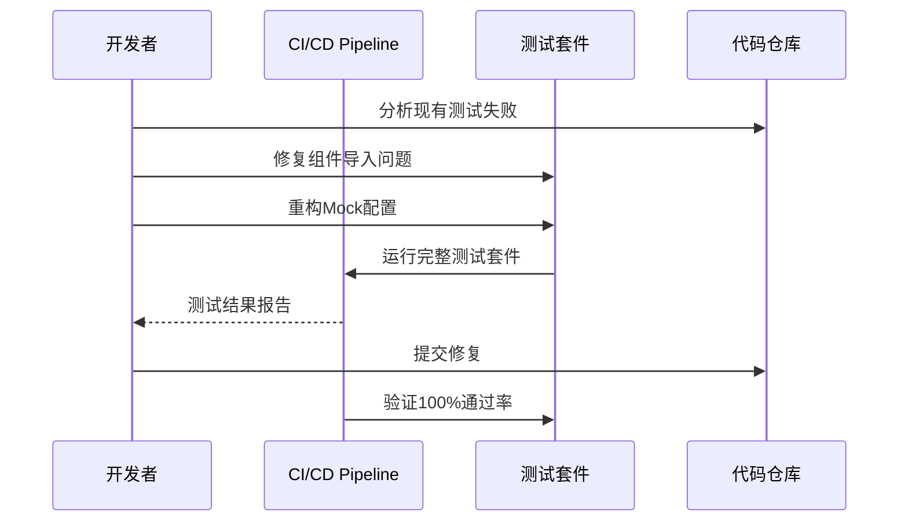
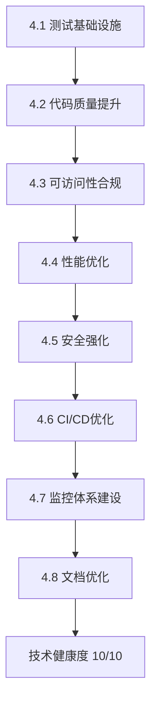

# Epic Technical Specification: 技术债务清理与质量保障全面提升

Date: 2025-11-24
Author: aTenderLion
Epic ID: 4
Status: contexted

---

## Overview

Epic 4专注于将项目的技术健康度从当前评估全面提升到企业级生产就绪标准的10分满分。根据当前技术健康度评估显示：架构设计9/10、代码质量7/10、文档完整性10/10、自动化程度9/10、测试覆盖6/10，存在明显的技术债务需要系统性清理。本Epic将通过8个递进的故事，从测试基础设施重构开始，逐步解决代码质量、可访问性合规、性能优化、安全增强、CI/CD优化、监控体系建设，最终完善文档和开发者体验，为后续高级功能开发奠定坚实基础。

## Objectives and Scope

### In-Scope Objectives:
1. **测试基础设施全面重构** - 修复所有59个测试中的17个失败测试，实现100%通过率
2. **代码质量与类型安全提升** - 启用严格TypeScript模式，建立代码质量门禁
3. **可访问性合规全面实现** - 达到WCAG 2.1 AA标准，支持键盘导航和屏幕阅读器
4. **性能优化与监控体系建立** - 优化Core Web Vitals指标，建立性能监控
5. **安全性与数据保护强化** - 零安全漏洞，实现数据加密和安全头配置
6. **CI/CD管道全面优化** - 缩短部署时间，建立质量门禁和自动化检查
7. **监控和可观测性体系建设** - 集成APM工具，建立日志聚合和告警系统
8. **文档和开发者体验全面优化** - 完善开发文档，实现开发环境一键配置

### Out-of-Scope:
- 全新功能开发（专注于质量提升和技术债务清理）
- 数据库架构重大变更（仅在必要时进行优化）
- 第三方服务替换（仅进行安全性和性能优化）
- 用户界面重新设计（仅进行可访问性和性能改进）

## System Architecture Alignment

本Epic完全遵循现有架构设计（验证评分97.4%），建立在Next.js 14 + FastAPI + TypeScript全栈架构基础上：

**技术栈对齐：**
- 前端：Next.js 14 + TypeScript + Chart.js 4.4+（性能优化）
- 后端：FastAPI + Python + SQLite 3.44+ + Redis 7.2+（安全增强）
- 部署：Vercel（前端）+ 合适的后端部署平台（CI/CD优化）
- 测试：Jest + React Testing Library（测试基础设施重构）
- 代码质量：ESLint + Prettier + Husky（代码质量提升）

**架构模式对齐：**
- REST API模式保持一致，添加安全性和性能增强
- 组件组织模式延续，添加可访问性改进
- 错误处理模式扩展，集成监控和告警
- 缓存策略优化，提升系统性能
- 日志模式标准化，支持可观测性需求

**集成点对齐：**
- AKShare API集成保持，添加错误处理和监控
- Redis缓存策略保持，优化性能配置
- 数据持久化模式保持，添加安全加密
- 前后端类型安全保持，强化类型检查

## Detailed Design

### Services and Modules

#### 测试基础设施模块
```
frontend/
├── __tests__/
│   ├── setup/
│   │   ├── jest.setup.js (增强配置)
│   │   ├── test-utils.tsx (自定义工具)
│   │   └── mocks/ (完整Mock配置)
│   ├── unit/ (单元测试)
│   ├── integration/ (集成测试)
│   └── e2e/ (端到端测试)
├── components/
│   └── __tests__/ (组件同级测试)
└── test-fixtures/ (测试数据)
```

#### 代码质量模块
```
config/
├── eslint.config.js (增强ESLint配置)
├── prettier.config.js (标准化配置)
├── husky.config.js (Git Hooks)
└── lint-staged.config.js (预提交检查)
```

#### 性能监控模块
```
frontend/src/services/
├── performanceService.ts (性能指标收集)
├── monitoringService.ts (APM集成)
└── optimizationService.ts (性能优化)
```

#### 可访问性模块
```
frontend/src/components/
├── accessible/ (可访问组件库)
├── hooks/useAccessibility.ts (可访问性钩子)
└── utils/accessibilityHelpers.ts (辅助函数)
```

### Data Models and Contracts

#### 技术健康度评估模型
```typescript
interface TechnicalHealthScore {
  epicId: string;
  assessmentDate: Date;
  scores: {
    architecture: number;      // 1-10 scale
    codeQuality: number;       // 1-10 scale
    documentation: number;     // 1-10 scale
    automation: number;        // 1-10 scale
    testCoverage: number;      // 1-10 scale
  };
  testResults: {
    total: number;
    passed: number;
    failed: number;
    coverage: number;          // percentage
  };
  performanceMetrics: {
    lighthouse: number;        // 1-100 scale
    bundleSize: number;        // bytes
    loadTime: number;          // milliseconds
  };
  securityStatus: {
    vulnerabilities: {
      high: number;
      medium: number;
      low: number;
    };
    complianceStatus: 'compliant' | 'partial' | 'non-compliant';
  };
}
```

#### 质量门禁配置
```typescript
interface QualityGateConfig {
  minimumTestCoverage: number;    // 85%
  maximumTestFailures: number;    // 0
  maximumVulnerabilities: {
    high: number;                 // 0
    medium: number;               // 2
  };
  performanceThresholds: {
    lighthouse: number;           // 90
    bundleSizeLimit: number;      // 1MB
    loadTimeLimit: number;        // 3s
  };
  accessibilityCompliance: 'WCAG_2.1_AA';
}
```

### APIs and Interfaces

#### 技术健康检查API
```typescript
// GET /api/health/technical-scores
interface TechnicalScoresResponse {
  currentScores: TechnicalHealthScore;
  targetScores: TechnicalHealthScore;
  improvementPlan: QualityImprovementTask[];
}

// POST /api/health/quality-gate
interface QualityGateRequest {
  epicId: string;
  checks: QualityGateCheck[];
}

interface QualityGateResponse {
  passed: boolean;
  violations: QualityViolation[];
  recommendations: string[];
}
```

#### 性能监控API
```typescript
// GET /api/monitoring/performance
interface PerformanceMetricsResponse {
  coreWebVitals: {
    lcp: number;    // Largest Contentful Paint
    fid: number;    // First Input Delay
    cls: number;    // Cumulative Layout Shift
  };
  bundleMetrics: {
    size: number;
    gzippedSize: number;
    chunkCount: number;
  };
  runtimeMetrics: {
    renderTime: number;
    apiResponseTime: number;
    errorRate: number;
  };
}
```

#### 安全扫描API
```typescript
// GET /api/security/scan-results
interface SecurityScanResponse {
  vulnerabilities: Vulnerability[];
  securityHeaders: SecurityHeader[];
  dependencyAudit: DependencyAudit;
  complianceStatus: ComplianceStatus;
}
```

### Workflows and Sequencing

#### Story 4.1: 测试基础设施重构序列


#### Story 4.2-4.8 递进实施序列


#### 质量门禁检查流程
1. **预提交检查** - Husky + lint-staged
2. **代码质量扫描** - ESLint + Prettier + SonarQube
3. **安全扫描** - Snyk + OWASP ZAP
4. **测试执行** - 单元测试 + 集成测试 + E2E测试
5. **性能测试** - Lighthouse + Bundle分析
6. **可访问性测试** - axe-automated + 手动验证
7. **部署决策** - 质量门禁通过/失败判断

## Non-Functional Requirements

### Performance

#### Core Web Vitals 目标
- **Largest Contentful Paint (LCP):** < 2.5秒 (Google推荐标准)
- **First Input Delay (FID):** < 100毫秒 (用户交互响应时间)
- **Cumulative Layout Shift (CLS):** < 0.1 (视觉稳定性)

#### Bundle 大小限制
- **主Bundle:** ≤ 500KB (gzipped)
- **总JavaScript大小:** ≤ 1MB (gzipped)
- **首屏关键资源:** ≤ 250KB

#### 测试执行性能
- **单元测试套件:** < 30秒执行时间
- **集成测试:** < 2分钟执行时间
- **E2E测试:** < 5分钟执行时间
- **CI/CD总执行时间:** < 10分钟

#### 代码质量工具性能
- **ESLint检查:** < 15秒
- **TypeScript编译:** < 30秒
- **安全扫描:** < 60秒

### Security

#### 依赖安全标准
- **高危漏洞:** 0个 tolerated
- **中危漏洞:** ≤ 2个 tolerated (需有修复计划)
- **自动安全扫描:** 每次提交和PR
- **依赖更新:** 每月自动检查和更新

#### 代码安全实践
- **输入验证:** 所有用户输入必须验证和清理
- **API安全:** Rate limiting (100请求/分钟/IP)
- **CORS配置:** 仅允许可信域名
- **安全HTTP头:** CSP, HSTS, X-Frame-Options等
- **敏感数据:** 加密存储，不在客户端暴露

#### 测试安全
- **测试数据:** 不包含真实用户数据
- **API密钥:** 使用环境变量，不提交到代码库
- **测试环境:** 与生产环境隔离

### Reliability/Availability

#### 测试可靠性目标
- **测试稳定性:** 99.5% 通过率 (允许0.5%间歇性失败)
- **测试环境可用性:** 99.9% 时间可用
- **CI/CD管道可靠性:** 99% 成功执行率

#### 质量检查可靠性
- **代码质量扫描:** 100% 提交触发，0误报
- **安全扫描:** 100% 覆盖，准确率 > 95%
- **性能监控:** 实时数据，延迟 < 1分钟

#### 回滚机制
- **部署回滚:** < 5分钟完成回滚
- **数据恢复:** < 30分钟恢复到安全状态
- **服务降级:** 关键功能优先保障

### Observability

#### 监控指标覆盖
- **技术健康度评分:** 实时更新，历史趋势追踪
- **测试指标:** 覆盖率、通过率、执行时间
- **性能指标:** Bundle大小、加载时间、Core Web Vitals
- **安全指标:** 漏洞数量、合规状态、扫描结果
- **代码质量指标:** ESLint错误、TypeScript错误、代码重复率

#### 日志记录标准
- **结构化日志:** JSON格式，统一字段
- **日志级别:** ERROR, WARN, INFO, DEBUG
- **敏感信息过滤:** 自动检测和屏蔽
- **日志聚合:** 集中式收集和查询
- **日志保留:** 30天热数据，90天冷数据

#### 告警和通知
- **关键指标阈值:** 超过阈值自动告警
- **多渠道通知:** 邮件、Slack、短信
- **告警升级:** 无人响应时自动升级
- **告警抑制:** 避免重复告警风暴

#### 可视化仪表板
- **技术健康度仪表板:** 实时展示所有指标
- **趋势分析:** 历史数据对比和预测
- **质量门禁状态:** 直观显示通过/失败状态
- **改进进度追踪:** Epic实施进度可视化

## Dependencies and Integrations

### 测试和质量工具依赖

#### 新增测试依赖 (Story 4.1)
```json
{
  "devDependencies": {
    "@testing-library/jest-dom": "^6.4.6",      // 现有，需升级
    "@testing-library/react": "^15.0.7",         // 现有，需升级
    "@testing-library/user-event": "^14.5.1",    // 新增：用户交互测试
    "jest-axe": "^9.0.0",                        // 新增：可访问性测试
    "msw": "^2.0.11",                            // 新增：API Mock服务
    "@jest/coverage-merge": "^1.0.1",            // 新增：覆盖率合并
    "jest-performance-testing": "^1.0.0"         // 新增：性能测试
  }
}
```

#### 代码质量工具依赖 (Story 4.2)
```json
{
  "devDependencies": {
    "eslint": "^8.57.0",                         // 现有，需升级
    "@typescript-eslint/eslint-plugin": "^7.0.0", // 升级
    "@typescript-eslint/parser": "^7.0.0",       // 升级
    "prettier": "^3.2.4",                        // 现有，需升级
    "husky": "^9.0.11",                          // 新增：Git Hooks
    "lint-staged": "^15.2.0",                    // 新增：预提交检查
    "@commitlint/cli": "^18.4.3",                // 新增：Commit规范
    "@commitlint/config-conventional": "^18.4.3", // 新增：标准Commit格式
    "sonarqube-scanner": "^3.0.1"                // 新增：代码质量扫描
  }
}
```

#### 性能和安全工具依赖 (Story 4.4-4.5)
```json
{
  "dependencies": {
    "web-vitals": "^4.0.0",                      // 新增：Core Web Vitals
    "@sentry/react": "^8.0.0",                   // 新增：错误监控
    "@sentry/tracing": "^8.0.0",                 // 新增：性能追踪
    "helmet": "^7.1.0"                           // 新增：安全HTTP头
  },
  "devDependencies": {
    "lighthouse": "^12.0.0",                     // 新增：性能审计
    "bundle-analyzer": "^0.1.0",                 // 新增：Bundle分析
    "snyk": "^1.1200.0",                         // 新增：安全扫描
    "@vercel/nft": "^0.26.0"                     // 新增：依赖追踪
  }
}
```

### CI/CD集成依赖

#### GitHub Actions工作流
```yaml
# .github/workflows/quality-gate.yml
name: Quality Gate Pipeline
on:
  push: { branches: [main] }
  pull_request: { branches: [main] }

jobs:
  quality-check:
    runs-on: ubuntu-latest
    steps:
      - name: Security Scan
        uses: snyk/actions/node@master

      - name: Performance Audit
        uses: treosh/lighthouse-ci-action@v10

      - name: Accessibility Test
        uses: mozilla/accessibility-lighthouse-action@v3

      - name: Quality Gate
        uses: sonarqube-quality-gate-action@master
```

#### Docker化测试环境
```dockerfile
# Dockerfile.test
FROM node:18-alpine
WORKDIR /app
COPY package*.json ./
RUN npm ci --only=production
COPY . .
CMD ["npm", "test"]
```

### 外部服务集成

#### 监控和APM服务
- **Sentry:** 错误追踪和性能监控
  - DSN配置环境变量: `SENTRY_DSN`
  - 采样率: 1.0 (开发), 0.1 (生产)
- **Vercel Analytics:** 前端性能分析
- **GitHub Actions:** CI/CD管道和自动化检查

#### 代码质量服务
- **SonarQube:** 代码质量度量和技术债务分析
  - 项目密钥配置
  - 质量门禁规则配置
- **Snyk:** 依赖安全扫描
  - API令牌配置
  - 自动修复建议集成

#### 性能监控服务
- **Google PageSpeed Insights:** Core Web Vitals监控
- **WebPageTest:** 性能基准测试
- **Bundlephobia:** Bundle大小分析

### 数据集成

#### 技术健康度数据模型
```typescript
// 集成到现有数据存储
interface TechnicalHealthRepository {
  // 从现有测试结果提取数据
  getTestResults(): Promise<TestResults>;

  // 从CI/CD获取构建数据
  getBuildMetrics(): Promise<BuildMetrics>;

  // 从安全扫描获取漏洞数据
  getSecurityData(): Promise<SecurityData>;

  // 存储技术健康度评分
  saveHealthScore(score: TechnicalHealthScore): Promise<void>;
}
```

#### 性能数据收集
```typescript
// 集成到现有性能监控
interface PerformanceDataCollector {
  // Core Web Vitals收集
  collectWebVitals(): Promise<WebVitals>;

  // Bundle分析数据
  collectBundleMetrics(): Promise<BundleMetrics>;

  // 运行时性能数据
  collectRuntimeMetrics(): Promise<RuntimeMetrics>;
}
```

### 工具链集成配置

#### ESLint配置增强
```javascript
// eslint.config.js
module.exports = {
  extends: [
    '@typescript-eslint/recommended-requiring-type-checking',
    'plugin:react-hooks/recommended',
    'plugin:jsx-a11y/strict'
  ],
  rules: {
    '@typescript-eslint/no-unused-vars': 'error',
    '@typescript-eslint/prefer-nullish-coalescing': 'error',
    'jsx-a11y/anchor-is-valid': 'error'
  }
};
```

#### TypeScript严格配置
```json
// tsconfig.json增强
{
  "compilerOptions": {
    "strict": true,
    "noUncheckedIndexedAccess": true,
    "exactOptionalPropertyTypes": true,
    "noImplicitReturns": true
  }
}
```

## Acceptance Criteria (Authoritative)

### Story 4.1: 测试基础设施全面重构
1. **测试通过率达到100%** - 所有59个测试全部通过，零失败
2. **Mock配置完整** - 所有组件、API、数据Mock正确配置
3. **测试分层清晰** - 单元测试、集成测试、E2E测试职责分明
4. **测试覆盖率≥85%** - 自动化报告，覆盖率目标达成
5. **组件导入修复** - TutorialSystem等组件导入问题完全解决

### Story 4.2: 代码质量与类型安全提升
1. **TypeScript严格模式** - `strict: true`，`noUncheckedIndexedAccess: true`
2. **ESLint增强配置** - 零TypeScript错误，零ESLint警告
3. **代码格式标准化** - Prettier配置，编辑器集成
4. **Pre-commit Hooks** - Husky + lint-staged 100%自动检查
5. **代码质量度量** - SonarQube集成，技术债务评分A+

### Story 4.3: 可访问性合规全面实现
1. **WCAG 2.1 AA合规** - axe-automated和手动测试100%通过
2. **键盘导航完整** - 所有交互元素键盘可访问
3. **屏幕阅读器优化** - 适当ARIA labels，语义化HTML
4. **颜色对比度优化** - WCAG AA级别对比度 (4.5:1)
5. **可访问性测试自动化** - Jest-axe集成，CI自动检查

### Story 4.4: 性能优化与监控体系建立
1. **Core Web Vitals优化** - LCP < 2.5s, FID < 100ms, CLS < 0.1
2. **Bundle大小减少20%** - JavaScript包优化，代码分割
3. **图表性能基准** - 大数据量渲染性能优化
4. **性能监控集成** - Sentry Performance + Web Vitals
5. **性能预算CI检查** - 自动化性能回归检测

### Story 4.5: 安全性与数据保护强化
1. **依赖安全扫描** - Snyk/NPM Audit集成，0高危漏洞
2. **API安全增强** - Rate limiting, CORS优化, 输入验证
3. **数据加密** - 敏感数据存储加密，传输HTTPS
4. **安全头配置** - CSP, HSTS, X-Frame-Options完整配置
5. **安全测试自动化** - OWASP ZAP基础扫描集成

### Story 4.6: CI/CD管道全面优化
1. **管道性能优化** - 总执行时间 < 10分钟
2. **并行测试执行** - 测试套件并行化，50%+时间节省
3. **质量门禁集成** - 代码质量、安全、性能检查自动化
4. **环境一致性** - 开发/测试/生产环境完全一致
5. **部署策略优化** - 蓝绿部署或滚动更新支持

### Story 4.7: 监控和可观测性体系建设
1. **APM集成** - Sentry/DataDog完整集成
2. **日志聚合分析** - 结构化日志，ELK栈或类似
3. **健康检查端点** - /health, /ready, /metrics端点
4. **告警通知系统** - 关键指标阈值告警
5. **错误追踪分析** - 完整错误上下文和堆栈跟踪

### Story 4.8: 文档和开发者体验全面优化
1. **开发者文档完善** - README, Contributing, Architecture docs
2. **API文档自动生成** - OpenAPI/Swagger，交互式文档
3. **组件文档和Storybook** - UI组件完整文档和示例
4. **开发环境一键配置** - Docker Compose，环境变量模板
5. **代码贡献指南** - Git工作流，Code Review标准

## Traceability Mapping

| AC ID | 验收标准 | 设计章节 | 组件/模块 | API/接口 | 测试策略 |
|-------|----------|----------|-----------|----------|----------|
| AC-4.1-1 | 100%测试通过率 | 详细设计-测试基础设施 | Jest, Test Utils | - | 单元测试套件 |
| AC-4.1-2 | Mock配置完整 | 详细设计-测试基础设施 | Mocks/, test-utils | - | 集成测试验证 |
| AC-4.1-3 | 测试分层清晰 | 详细设计-测试基础设施 | __tests__/目录结构 | - | 测试架构验证 |
| AC-4.1-4 | 测试覆盖率≥85% | 非功能性需求-性能 | Coverage Reports | - | 覆盖率测试 |
| AC-4.1-5 | 组件导入修复 | 详细设计-测试基础设施 | Component fixes | - | 组件渲染测试 |
| AC-4.2-1 | TypeScript严格模式 | 详细设计-代码质量模块 | TSConfig, ESLint | - | 类型检查验证 |
| AC-4.2-2 | ESLint增强配置 | 详细设计-代码质量模块 | ESLint Config | - | 代码质量检查 |
| AC-4.2-3 | 代码格式标准化 | 详细设计-代码质量模块 | Prettier Config | - | 格式化验证 |
| AC-4.2-4 | Pre-commit Hooks | 依赖集成-CI/CD | Husky, lint-staged | - | Git hooks测试 |
| AC-4.2-5 | 代码质量度量 | 监控和可观测性 | SonarQube | /api/quality | 质量门禁测试 |
| AC-4.3-1 | WCAG 2.1 AA合规 | 详细设计-可访问性模块 | Accessibility Components | - | Jest-axe测试 |
| AC-4.3-2 | 键盘导航完整 | 详细设计-可访问性模块 | Keyboard Navigation | - | 键盘交互测试 |
| AC-4.3-3 | 屏幕阅读器优化 | 详细设计-可访问性模块 | ARIA Labels | - | 屏幕阅读器测试 |
| AC-4.3-4 | 颜色对比度优化 | 详细设计-可访问性模块 | Color System | - | 对比度验证 |
| AC-4.3-5 | 可访问性自动化 | 依赖集成-CI/CD | Lighthouse CI | - | 可访问性扫描 |
| AC-4.4-1 | Core Web Vitals优化 | 非功能性需求-性能 | Performance Service | /api/performance | Lighthouse测试 |
| AC-4.4-2 | Bundle大小减少 | 非功能性需求-性能 | Bundle Analyzer | - | Bundle分析测试 |
| AC-4.4-3 | 图表性能基准 | 详细设计-性能监控 | Chart Optimization | - | 性能基准测试 |
| AC-4.4-4 | 性能监控集成 | 外部服务集成 | Sentry | /api/monitoring | APM集成测试 |
| AC-4.4-5 | 性能预算CI检查 | 依赖集成-CI/CD | Lighthouse CI | - | 性能预算验证 |
| AC-4.5-1 | 依赖安全扫描 | 外部服务集成 | Snyk | /api/security | 安全扫描测试 |
| AC-4.5-2 | API安全增强 | 非功能性需求-安全 | Helmet, CORS | API endpoints | 安全头验证 |
| AC-4.5-3 | 数据加密 | 非功能性需求-安全 | Encryption Utils | - | 加密解密测试 |
| AC-4.5-4 | 安全头配置 | 非功能性需求-安全 | Helmet Config | - | 安全头检查 |
| AC-4.5-5 | 安全测试自动化 | 依赖集成-CI/CD | OWASP ZAP | - | 安全扫描测试 |
| AC-4.6-1 | 管道性能优化 | 依赖集成-CI/CD | GitHub Actions | - | CI/CD性能测试 |
| AC-4.6-2 | 并行测试执行 | 依赖集成-CI/CD | Jest Parallel | - | 并行执行验证 |
| AC-4.6-3 | 质量门禁集成 | 数据集成 | Quality Gate API | /api/quality-gate | 门禁验证测试 |
| AC-4.6-4 | 环境一致性 | 依赖集成-Docker | Docker Config | - | 环境一致性测试 |
| AC-4.6-5 | 部署策略优化 | 依赖集成-CI/CD | Vercel Config | - | 部署策略测试 |
| AC-4.7-1 | APM集成 | 外部服务集成 | Sentry Config | /api/monitoring | APM集成测试 |
| AC-4.7-2 | 日志聚合分析 | 数据集成 | Logging Service | /api/logs | 日志聚合测试 |
| AC-4.7-3 | 健康检查端点 | APIs和接口 | Health API | /health, /ready | 健康检查测试 |
| AC-4.7-4 | 告警通知系统 | 监控和可观测性 | Alert Service | /api/alerts | 告警系统测试 |
| AC-4.7-5 | 错误追踪分析 | 监控和可观测性 | Error Tracking | /api/errors | 错误追踪测试 |
| AC-4.8-1 | 开发者文档完善 | 文档和开发者体验 | Documentation Site | - | 文档完整性检查 |
| AC-4.8-2 | API文档自动生成 | APIs和接口 | Swagger/OpenAPI | /api/docs | API文档验证 |
| AC-4.8-3 | 组件文档Storybook | 文档和开发者体验 | Storybook | /storybook | 组件文档验证 |
| AC-4.8-4 | 开发环境一键配置 | 文档和开发者体验 | Docker Compose | - | 环境配置测试 |
| AC-4.8-5 | 代码贡献指南 | 文档和开发者体验 | Contributing Guide | - | 开发流程验证 |

## Risks, Assumptions, Open Questions

### 风险评估 (Risks)

#### 高风险
1. **技术债务复杂性超出预期**
   - 风险描述: 17/59测试失败可能隐藏更深层的架构问题
   - 影响: Epic实施时间和资源需求可能超出预估
   - 缓解策略: 分阶段实施，每个Story完成后重新评估技术健康状况
   - 应急方案: 如果复杂度过高，优先处理关键功能的质量问题

2. **外部服务依赖稳定性**
   - 风险描述: Sentry、SonarQube、Snyk等外部服务可能存在服务中断
   - 影响: CI/CD管道和监控体系可能受到影响
   - 缓解策略: 多服务备份，本地化关键功能
   - 应急方案: 准备开源替代方案

#### 中风险
3. **性能目标可能冲突**
   - 风险描述: 代码质量工具可能增加构建时间和Bundle大小
   - 影响: Core Web Vitals指标和CI/CD性能目标可能受影响
   - 缓解策略: 性能预算管理，渐进式优化
   - 监控指标: 持续监控Bundle大小和构建时间

4. **团队技能匹配**
   - 风险描述: 团队对新工具链的学习曲线可能影响开发效率
   - 影响: Epic实施进度可能延期
   - 缓解策略: 团队培训，结对编程，知识共享
   - 支持措施: 详细文档，最佳实践指南

#### 低风险
5. **现有功能回归**
   - 风险描述: 大规模重构可能引入新的功能问题
   - 影响: 现有用户体验可能受影响
   - 缓解策略: 完整的回归测试套件，渐进式部署
   - 监控措施: 生产环境错误监控和用户反馈

### 假设 (Assumptions)

1. **技术栈兼容性假设**
   - 现有Next.js 14 + TypeScript + Chart.js技术栈与新的质量工具兼容
   - Vercel部署平台支持新的监控和安全工具
   - 团队开发环境满足工具运行要求

2. **资源可用性假设**
   - 开发团队有足够时间投入到技术债务清理工作中
   - 外部服务预算充足（Sentry Pro、SonarQube等）
   - 基础设施资源支持新的CI/CD管道要求

3. **优先级假设**
   - 技术质量提升被确认为当前最高优先级
   - 新功能开发可以在Epic 4完成后继续进行
   - 项目管理层面支持质量改进工作

### 开放问题 (Open Questions)

1. **监控数据存储策略**
   - 问题: 技术健康度历史数据应如何存储和查询？
   - 需要明确: 是否需要专门的时间序列数据库？
   - 决策时间点: Story 4.7实施前

2. **代码质量标准权衡**
   - 问题: 如果严格TypeScript模式导致大量现有代码需要修改，如何平衡？
   - 需要明确: 是否允许临时配置宽松规则？
   - 决策时间点: Story 4.2开始前

3. **性能基准设定**
   - 问题: Bundle大小减少20%的目标是否现实？
   - 需要明确: 当前Bundle基线大小是多少？
   - 决策时间点: Story 4.4开始前

## Test Strategy Summary

### 测试架构设计

#### 多层次测试策略
```
金字塔式测试架构:
    E2E Tests (10%) - 关键用户流程
     ↑
Integration Tests (20%) - 组件间交互
     ↑
Unit Tests (70%) - 函数和组件单元
```

#### 测试环境策略
- **本地开发**: Jest + React Testing Library快速反馈
- **CI/CD环境**: 并行测试执行，完整覆盖率报告
- **预生产环境**: 完整E2E测试，性能和安全扫描
- **生产监控**: 错误追踪和性能指标实时监控

### 关键测试领域

#### 1. 功能质量测试
- **测试覆盖目标**: ≥85%代码覆盖率
- **测试分层**: 单元测试、集成测试、E2E测试
- **Mock策略**: API Mock、组件Mock、数据Mock完整配置
- **测试数据管理**: 固定测试数据 + 动态生成数据

#### 2. 性能测试
- **Core Web Vitals测试**: Lighthouse自动化审计
- **Bundle分析**: webpack-bundle-analyzer持续监控
- **性能回归测试**: 关键页面性能基准对比
- **大数据量测试**: 图表组件在1万+数据点下的表现

#### 3. 可访问性测试
- **自动化扫描**: jest-axe + axe-core集成测试
- **键盘导航测试**: 所有交互组件键盘可访问性
- **屏幕阅读器测试**: VoiceOver/NVDA/JAWS兼容性
- **颜色对比度测试**: WCAG AA级别对比度验证

#### 4. 安全测试
- **依赖安全扫描**: Snyk + npm audit自动化
- **API安全测试**: 输入验证、Rate limiting测试
- **XSS防护测试**: 用户输入清理和输出编码验证
- **HTTPS配置测试**: SSL/TLS证书和安全头验证

#### 5. 兼容性测试
- **浏览器兼容**: Chrome、Firefox、Safari、Edge最新版本
- **响应式测试**: 移动端、平板、桌面端适配
- **设备兼容**: 不同屏幕分辨率和设备类型测试

### 测试执行策略

#### 持续集成测试
```yaml
CI/CD Pipeline Tests:
1. 预提交检查 (本地)
   - Husky + lint-staged
   - 快速单元测试 (< 30s)

2. 推送验证 (CI)
   - 完整测试套件 (< 5min)
   - 代码质量扫描

3. PR验证 (CI)
   - 性能回归测试
   - 安全扫描
   - 可访问性检查

4. 部署前验证 (Staging)
   - E2E测试 (< 10min)
   - 完整性能审计
```

#### 测试数据管理
- **测试数据版本控制**: Git管理测试数据和fixture
- **隔离测试数据**: 每个测试使用独立数据避免污染
- **数据清理机制**: 测试前后自动清理临时数据
- **隐私保护**: 不使用真实用户数据，所有测试数据脱敏

### 质量保证流程

#### 质量门禁检查点
1. **代码提交前**: 预提交Hook检查
2. **PR合并前**: 质量门禁API验证
3. **发布部署前**: 生产就绪检查
4. **发布后监控**: 实时质量指标追踪

#### 缺陷管理策略
- **测试失败优先级**: Blocker > Critical > Major > Minor
- **修复时间目标**: Blocker(4h), Critical(24h), Major(72h), Minor(1w)
- **回归测试**: 关键缺陷修复后必须通过回归测试
- **缺陷根因分析**: Blocker和Critical级别缺陷必须分析根因

### 测试工具链集成

#### 测试工具生态
- **单元测试**: Jest + React Testing Library
- **E2E测试**: Playwright + 浏览器自动化
- **性能测试**: Lighthouse CI + WebPageTest API
- **可访问性测试**: axe-core + jest-axe
- **安全测试**: Snyk + OWASP ZAP
- **可视化测试**: Percy/Chromatic (可选)

#### 测试报告和可视化
- **覆盖率报告**: Jest Coverage + Istanbul
- **测试结果报告**: Allure/JaCoCo格式
- **质量仪表板**: SonarQube集成
- **性能监控**: Sentry Performance + Vercel Analytics