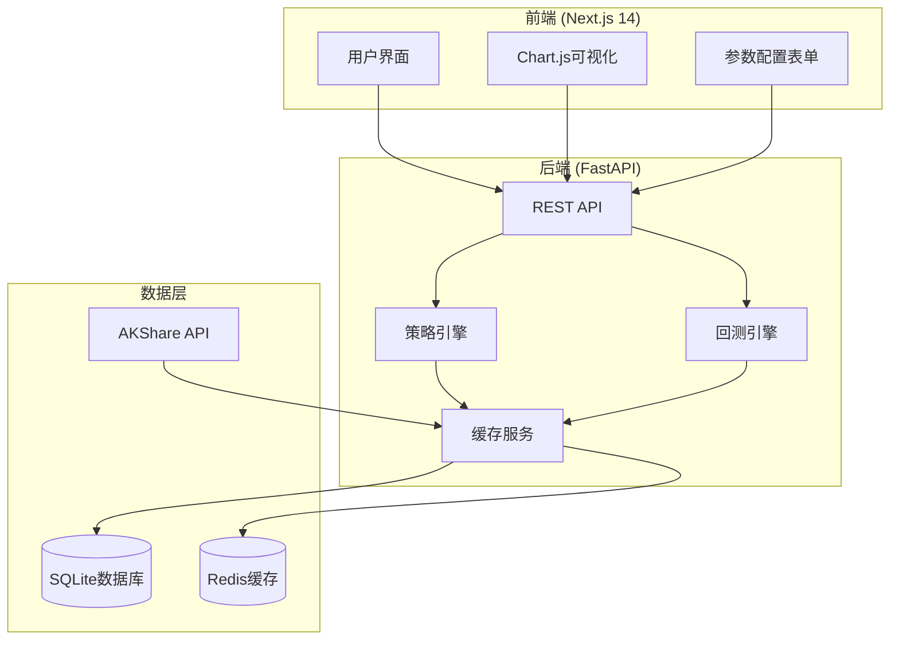

# 量化交易单均线策略分析平台 - Technical Specification

**Author:** aTenderLion
**Date:** 2025-11-01
**Project Level:** 2
**Document Type:** Technical Specification (Level 2 Standard)

---

## Executive Summary

本文档为量化交易单均线策略分析平台提供完整的技术实施规范。作为Level 2项目，技术规格书包含架构设计、技术栈选择和详细的实施指导，确保AI代理能够高效一致地执行开发任务。

项目采用 Next.js + FastAPI 现代全栈架构，重点关注快速开发（2天时间线）和教育导向的用户体验。通过TypeScript端到端类型安全和统一的实施模式，实现2个史诗共14个故事的功能交付。

---

## Technical Architecture Overview

### System Architecture



### Technology Stack

| 组件 | 技术选择 | 版本 | 用途 |
|------|----------|------|------|
| 前端框架 | Next.js | 14+ | React全栈框架，支持SSR和API路由 |
| 后端框架 | FastAPI | Latest | Python现代Web框架，自动API文档 |
| 数据库 | SQLite | 3.44+ | 轻量级数据库，适合快速开发 |
| 缓存 | Redis | 7.2+ | 内存缓存，优化API响应 |
| 数据可视化 | Chart.js | 4.4+ | 金融图表和策略结果展示 |
| 样式框架 | Tailwind CSS | Latest | 实用优先的CSS框架 |
| 数据获取 | AKShare | Latest | 中国期货市场数据源 |
| 部署平台 | Vercel | Platform | Next.js原生支持，自动CI/CD |

---

## Project Structure

```
quant-trading-platform/
├── README.md
├── docker-compose.yml
├── .env.example
├── .gitignore
│
├── frontend/                 # Next.js前端
│   ├── package.json
│   ├── tsconfig.json
│   ├── tailwind.config.js
│   ├── next.config.js
│   ├── src/
│   │   ├── app/              # App Router页面
│   │   │   ├── page.tsx      # 主页
│   │   │   ├── strategy/     # 策略分析页面
│   │   │   │   ├── page.tsx
│   │   │   │   └── components/
│   │   │   ├── tutorial/     # 教程页面
│   │   │   │   └── page.tsx
│   │   │   └── api/          # API路由
│   │   │       └── strategies/
│   │   ├── components/       # 可复用组件
│   │   │   ├── charts/       # 图表组件
│   │   │   │   ├── StrategyChart.tsx
│   │   │   │   ├── PriceChart.tsx
│   │   │   │   └── PerformanceChart.tsx
│   │   │   ├── forms/        # 表单组件
│   │   │   │   ├── StrategyForm.tsx
│   │   │   │   └── ParameterForm.tsx
│   │   │   └── ui/           # UI组件
│   │   │       ├── Button.tsx
│   │   │       ├── Card.tsx
│   │   │       └── Loading.tsx
│   │   ├── lib/              # 工具函数
│   │   │   ├── api.ts        # API客户端
│   │   │   ├── chart-config.ts # Chart.js配置
│   │   │   └── utils.ts      # 通用工具
│   │   ├── types/            # TypeScript类型定义
│   │   │   ├── strategy.ts   # 策略相关类型
│   │   │   └── api.ts        # API响应类型
│   │   └── hooks/            # React Hooks
│   │       ├── useStrategyData.ts
│   │       └── useMarketData.ts
│   └── public/               # 静态资源
│       ├── images/
│       └── favicon.ico
│
├── backend/                  # FastAPI后端
│   ├── requirements.txt
│   ├── Dockerfile
│   ├── main.py              # FastAPI应用入口
│   ├── app/
│   │   ├── __init__.py
│   │   ├── core/            # 核心配置
│   │   │   ├── config.py    # 应用配置
│   │   │   ├── security.py  # 安全相关
│   │   │   └── database.py  # 数据库连接
│   │   ├── models/          # 数据模型
│   │   │   ├── strategy.py  # 策略模型
│   │   │   └── market_data.py # 市场数据模型
│   │   ├── schemas/         # Pydantic模式
│   │   │   ├── strategy.py  # 策略API模式
│   │   │   └── market_data.py
│   │   ├── api/             # API路由
│   │   │   ├── v1/
│   │   │   │   ├── endpoints/
│   │   │   │   │   ├── strategies.py  # 策略API
│   │   │   │   │   ├── market_data.py # 数据API
│   │   │   │   │   └── backtest.py    # 回测API
│   │   │   │   └── api.py   # API路由汇总
│   │   │   └── deps.py      # 依赖注入
│   │   ├── services/        # 业务逻辑
│   │   │   ├── akshare_client.py # AKShare客户端
│   │   │   ├── strategy_engine.py  # 策略引擎
│   │   │   ├── backtest_engine.py  # 回测引擎
│   │   │   └── cache_service.py    # 缓存服务
│   │   └── utils/           # 工具函数
│   │       ├── logging.py   # 日志配置
│   │       └── helpers.py   # 辅助函数
│   └── tests/               # 测试文件
│       ├── test_api.py
│       └── test_services.py
│
└── docs/                    # 项目文档
    ├── api.md               # API文档
    ├── deployment.md        # 部署指南
    └── development.md       # 开发指南
```

---

## Core Technical Components

### 1. 数据获取模块 (AKShare Integration)

**位置**: `backend/app/services/akshare_client.py`

**功能**:
- 获取中国期货市场历史数据
- 支持多个版块（能源、金属、农产品、化工）
- 数据缓存和错误处理

**接口规范**:
```python
class AKShareClient:
    def get_market_data(self, symbol: str, start_date: str, end_date: str) -> List[MarketData]
    def get_available_symbols(self, sector: str) -> List[str]
    def refresh_data_cache(self, symbol: str) -> bool
```

**数据模型**:
```python
class MarketData(BaseModel):
    symbol: str
    date: datetime
    open_price: float
    high_price: float
    low_price: float
    close_price: float
    volume: int
    created_at: datetime
```

### 2. 策略引擎 (Strategy Engine)

**位置**: `backend/app/services/strategy_engine.py`

**单均线策略算法**:
```python
def calculate_moving_average(prices: List[float], period: int) -> List[float]
def generate_trading_signals(prices: List[float], ma: List[float]) -> List[Signal]
def calculate_position_value(signals: List[Signal], prices: List[float], initial_capital: float) -> List[float]
```

**交易信号逻辑**:
- **买入信号**: 价格上穿均线（金叉）
- **卖出信号**: 价格下穿均线（死叉）
- **止损机制**: 固定百分比止损（可配置）

### 3. 回测引擎 (Backtest Engine)

**位置**: `backend/app/services/backtest_engine.py`

**绩效指标计算**:
```python
def calculate_returns(position_values: List[float]) -> float
def calculate_max_drawdown(position_values: List[float]) -> float
def calculate_sharpe_ratio(returns: List[float], risk_free_rate: float = 0.02) -> float
def calculate_win_rate(trades: List[Trade]) -> float
```

**绩效指标模型**:
```python
class PerformanceMetrics(BaseModel):
    total_return: float
    max_drawdown: float
    sharpe_ratio: float
    win_rate: float
    profit_loss_ratio: float
    total_trades: int
```

### 4. 缓存服务 (Cache Service)

**位置**: `backend/app/services/cache_service.py`

**缓存策略**:
- 市场数据: Redis缓存24小时
- 策略结果: 缓存1小时
- 用户参数: 缓存30分钟

```python
class CacheService:
    def get_market_data(self, symbol: str, start_date: str, end_date: str) -> Optional[List[MarketData]]
    def set_market_data(self, symbol: str, data: List[MarketData], ttl: int = 86400) -> bool
    def get_strategy_result(self, strategy_id: str) -> Optional[StrategyResult]
    def set_strategy_result(self, strategy_id: str, result: StrategyResult, ttl: int = 3600) -> bool
```

---

## API Design

### REST API 端点

**数据API**:
```http
GET    /api/v1/market-data/symbols          # 获取可用期货品种
GET    /api/v1/market-data/history?symbol={symbol}&start={date}&end={date}
POST   /api/v1/market-data/refresh         # 刷新数据缓存
```

**策略API**:
```http
GET    /api/v1/strategies                   # 获取策略列表
POST   /api/v1/strategies/run               # 运行策略
GET    /api/v1/strategies/{id}/results      # 获取策略结果
```

**回测API**:
```http
POST   /api/v1/backtest                     # 执行回测
GET    /api/v1/backtest/{id}/report         # 获取回测报告
```

### API 响应格式

**成功响应**:
```json
{
  "success": true,
  "data": {
    "strategy_id": "strategy_123456",
    "results": [...]
  },
  "message": "操作成功"
}
```

**错误响应**:
```json
{
  "success": false,
  "error": {
    "type": "VALIDATION_ERROR|API_ERROR|STRATEGY_ERROR",
    "message": "参数验证失败",
    "details": {...}
  }
}
```

### 请求示例

**运行策略请求**:
```json
POST /api/v1/strategies/run
{
  "symbol": "CU2401",
  "start_date": "2023-01-01",
  "end_date": "2023-12-31",
  "parameters": {
    "ma_period": 20,
    "initial_capital": 100000,
    "stop_loss": 0.05
  }
}
```

---

## Frontend Architecture

### 组件层次结构

**页面组件**:
- `page.tsx` - 主页
- `strategy/page.tsx` - 策略分析页面
- `tutorial/page.tsx` - 教程页面

**核心组件**:
- `charts/StrategyChart.tsx` - 策略结果图表
- `charts/PriceChart.tsx` - 价格走势图
- `forms/StrategyForm.tsx` - 策略参数配置
- `forms/ParameterForm.tsx` - 参数调整表单

### 状态管理

**服务端状态** (React Query):
```typescript
const { data, isLoading, error, refetch } = useQuery({
  queryKey: ['strategy', strategyId],
  queryFn: () => strategyAPI.getResults(strategyId),
  staleTime: 5 * 60 * 1000, // 5分钟
});
```

**本地状态** (useState):
```typescript
const [parameters, setParameters] = useState<StrategyParams>({
  ma_period: 20,
  initial_capital: 100000,
  stop_loss: 0.05
});
```

### 数据可视化

**Chart.js 配置**:
```typescript
// 价格走势图配置
const priceChartConfig = {
  type: 'line',
  data: {
    labels: dates,
    datasets: [
      {
        label: '收盘价',
        data: prices,
        borderColor: 'rgb(75, 192, 192)',
        tension: 0.1
      },
      {
        label: '移动平均线',
        data: movingAverages,
        borderColor: 'rgb(255, 99, 132)',
        borderDash: [5, 5]
      }
    ]
  },
  options: {
    responsive: true,
    interaction: {
      intersect: false,
      mode: 'index'
    },
    plugins: {
      legend: { position: 'top' },
      tooltip: { mode: 'index', intersect: false }
    }
  }
};
```

---

## Implementation Guidelines

### Development Standards

**命名规范**:
- API端点: `/api/v1/strategies` (复数形式)
- 数据库: `market_data`, `strategy_results` (snake_case, 复数)
- 前端组件: `StrategyChart`, `MarketDataTable` (PascalCase)
- 文件名: `strategy-chart.tsx`, `market-data-table.tsx` (kebab-case)

**代码组织**:
- 测试文件: 与源文件同目录，使用 `.test.ts` 后缀
- 组件组织: 按功能分组，不按类型分组
- 错误处理: 统一错误响应格式，用户友好提示

### 错误处理模式

**前端错误边界**:
```typescript
try {
  const result = await strategyAPI.run(params);
  setData(result.data);
} catch (error) {
  setError({
    type: error.response?.data?.error?.type || 'UNKNOWN_ERROR',
    message: error.response?.data?.error?.message || '操作失败，请重试'
  });
}
```

**后端异常处理**:
```python
try:
    result = await strategy_engine.calculate(params)
except ValidationError as e:
    raise HTTPException(status_code=400, detail={
        "type": "VALIDATION_ERROR",
        "message": str(e),
        "details": {"field": e.field}
    })
```

### 性能优化

**前端优化**:
- Next.js静态生成和SSR
- Chart.js数据点限制（最大1000个点）
- 图片懒加载和压缩
- 代码分割和动态导入

**后端优化**:
- 异步数据库查询
- Redis缓存热点数据
- 数据库索引优化
- 连接池管理

**API性能**:
- 响应压缩（gzip）
- 缓存头设置
- 异步任务队列
- 超时控制（10秒）

---

## Testing Strategy

### 测试层次

**单元测试** (>80%覆盖率):
- 策略算法计算准确性
- API端点响应正确性
- 数据处理逻辑完整性

**集成测试**:
- 完整的数据获取到策略回测流程
- 前后端API交互
- 缓存机制有效性

**端到端测试**:
- 用户旅程完整性
- 错误处理和恢复
- 性能目标验证

### 测试环境设置

**后端测试**:
```python
# pytest配置
pytest backend/tests/ -v --cov=backend/app --cov-report=html
```

**前端测试**:
```bash
# Jest + React Testing Library
npm test -- --coverage --watchAll=false
```

---

## Deployment Configuration

### Vercel 部署设置

**vercel.json 配置**:
```json
{
  "buildCommand": "cd frontend && npm run build",
  "outputDirectory": "frontend/.next",
  "installCommand": "cd frontend && npm install",
  "framework": "nextjs",
  "functions": {
    "backend/api/*.py": {
      "runtime": "python3.9"
    }
  }
}
```

### 环境变量管理

**生产环境变量**:
```bash
# 数据库
DATABASE_URL=sqlite:///./quant_trading.db
REDIS_URL=redis://localhost:6379

# API配置
AKSHARE_CACHE_TTL=86400
MAX_RETRY_ATTEMPTS=3

# 安全
SECRET_KEY=your-secret-key
CORS_ORIGINS=https://yourdomain.vercel.app
```

### 开发环境设置

**必需工具**:
- Python 3.12+
- Node.js 18+
- pnpm (包管理器)
- Docker + Docker Compose
- Git

**快速启动命令**:
```bash
# 1. 克隆项目
git clone https://github.com/your-username/quant-trading-platform.git
cd quant-trading-platform

# 2. 设置后端环境
cd backend && python -m venv venv && source venv/bin/activate
pip install -r requirements.txt

# 3. 设置前端环境
cd ../frontend && pnpm install

# 4. 启动开发服务
cd backend && uvicorn main:app --reload --port 8000 &
cd frontend && pnpm dev
```

---

## Story Implementation Mapping

### Epic 1: 项目基础与数据核心

| 故事 | 技术组件 | 实施要点 | 预估时间 |
|------|----------|----------|----------|
| 1.1 项目初始化 | 项目结构、开发环境 | Next.js + FastAPI 模板设置 | 2小时 |
| 1.2 数据获取模块 | AKShare客户端 | API集成、错误处理 | 3小时 |
| 1.3 数据处理存储 | SQLite + Redis | 数据模型、缓存策略 | 3小时 |
| 1.4 策略算法 | 策略引擎 | 均线计算、信号生成 | 4小时 |
| 1.5 收益计算 | 回测引擎 | 绩效指标计算 | 3小时 |
| 1.6 API接口 | FastAPI路由 | RESTful API设计 | 3小时 |
| 1.7 前端界面 | Next.js页面 | 基础UI、响应式设计 | 4小时 |
| 1.8 集成测试 | 测试套件 | 端到端测试验证 | 3小时 |

### Epic 2: 用户体验与可视化展示

| 故事 | 技术组件 | 实施要点 | 预估时间 |
|------|----------|----------|----------|
| 2.1 数据可视化 | Chart.js组件 | 价格图表、交易信号 | 4小时 |
| 2.2 参数配置 | 表单组件 | 实时参数调整 | 3小时 |
| 2.3 绩效可视化 | 绩效图表 | 收益曲线、风险指标 | 4小时 |
| 2.4 交互教程 | 教程系统 | 引导式学习体验 | 4小时 |
| 2.5 多品种对比 | 对比功能 | 并列分析展示 | 3小时 |
| 2.6 体验优化 | UI/UX完善 | 响应式优化、错误处理 | 3小时 |

---

## Risk Mitigation

### 技术风险

**数据获取风险**:
- 风险: AKShare API限制或不稳定
- 缓解: 实现重试机制和本地缓存

**性能风险**:
- 风险: 策略计算超时 (>10秒)
- 缓解: 异步处理、进度反馈

**兼容性风险**:
- 风险: 浏览器兼容性问题
- 缓解: 使用成熟的Chart.js和Next.js

### 时间风险

**开发进度风险**:
- 风险: 2天时间不足以完成14个故事
- 缓解: 并行开发、核心功能优先

**学习曲线风险**:
- 风险: 技术栈学习时间超出预期
- 缓解: 准备技术文档、示例代码

---

## Quality Assurance

### 代码质量

**静态分析**:
- ESLint + Prettier (前端)
- Black + isort (后端)
- TypeScript strict mode

**代码审查检查点**:
- API设计一致性
- 错误处理完整性
- 性能考虑充分性
- 安全性验证

### 用户体验质量

**性能指标**:
- 页面加载时间 < 3秒
- 策略回测响应 < 10秒
- API响应时间 < 500ms

**可用性指标**:
- 30分钟内完成策略学习
- 错误恢复时间 < 1分钟
- 移动端适配完整

---

## Conclusion

本技术规格书为量化交易单均线策略分析平台提供了完整的实施指导。通过标准化的技术栈、清晰的架构设计和详细的实施规范，确保AI代理能够高效一致地完成开发任务。

关键成功因素：
1. **快速开发导向**: 选择成熟技术栈，减少学习成本
2. **教育用户体验**: 关注30分钟学习目标的设计实现
3. **性能目标明确**: 具体的响应时间和处理能力要求
4. **质量标准统一**: 代码规范和测试覆盖的明确要求

项目具备成功实施的所有技术条件，建议立即开始Phase 4实施阶段。

---

*Technical Specification generated for BMAD Level 2 project*
*Date: 2025-11-01*
*Author: aTenderLion*